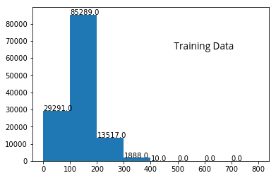

# Question_Answering_on_SQuAD
> Dyanamic Coattention Networks for Question and Answering.

## Papers Implemented:
   * [DCN+: MIXED OBJECTIVE AND DEEP RESIDUAL COATTENTION FOR QUESTION ANSWERING](https://arxiv.org/abs/1711.00106)
   * [DYNAMIC COATTENTION NETWORKS FOR QUESTION ANSWERING](https://arxiv.org/abs/1611.01604)
   * [Coattention Answer-Pointer Networks for Question Answering](https://web.stanford.edu/class/cs224n/reports/2761042.pdf)
   * [Short Passages Reading Comprehension and Question Answering](http://www.ccs.neu.edu/home/luwang/courses/reports_cs6120_fa17/2.pdf)

### About the code:
  * **data_preprocess.py** : This file preprocess the given train and dev json datasets into the desired format. This file                                asks for three inputs from the command line:
                             - Path to JSON Training file.
                             - Path to JSON Dev file.
                             - Path to the pre-trained Glove Embeddings.
                             After execution, some pickles files like word_to_idx dictionary, embedding matrix, passages,                                  questions, spans, answers etc are generated which are to be stored in a folder named                                          **model_pickles** in the same directory. So if this directory is not present already, **then you                              should create one.** 
                             **Final dataset generated has only those examples where passage lengths are less than 400.**
                             One can change this to any other value by changing the value of the variable                                                  **max_length_of_passage**  defined in line 16.
                             
                            
                        
                             ''' 
                              Run python data_preprocess.py -h for more information.
                             '''              
                       
* **evaluate-v2.0 (1).py** : This is the official evaluation script of SQuAD dataset but some changes are made from lines 
                             **268  to 272** of this script to keep track of only F score and exact match for dev accuracy.
  
* **help_functions.py** : This file contains some of the key functions which are either required to load the dataset in the                             beginning or when the model is training or validating on the given dataset.
  
* **model.py** : The proposed approach is taken from the four papers mentioned above and this file contains the                                implementation to it.
  
* **train.py** : This is the training+validating file which is to be executed to the run the program. Some hyperparameters                    are to be passed either through command line or one can also change them after opening this file in an                        editor. Lines **25 to 39** defines the hyperparameters of the model.

                 '''        
                    Run python train.py -h for more information.
                 '''
                 
     After every epoch, the model is saved in a foled named **saved_model** and results are stored in a folder named              **results** so you should also create these folder before excuting the code.
 
Accuracy and loss for both train as well as dev data are also examined using Tensorboard. One can run a Tensorbaord session to see the performance of the model.

### About the dataset:
Processed dataset is the form of dictionary whose key is a unique id present for every question, answer and span triplet. The value corresponding to every key in the dataset dictionary is a list containing passage, question, answer, span, tokenized passage, tokenized question, tokenized_passage and tokenized_question mapped using the word_to_idx dict to a list of numbers.

Given below is the plot of number of examples lying in different length ranges.

   

